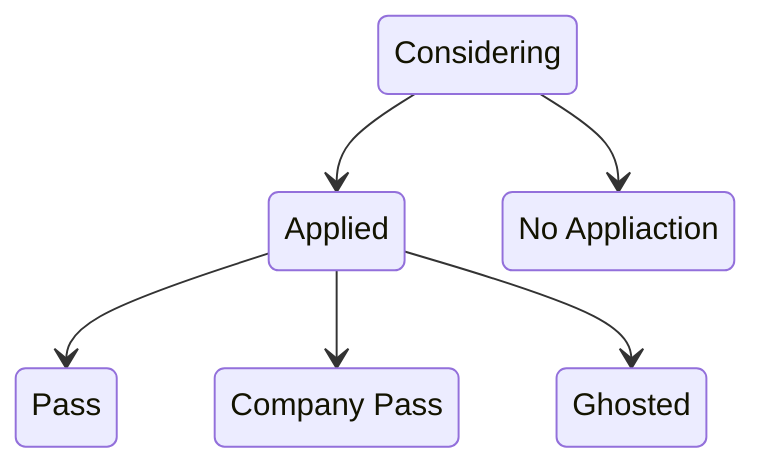

I use a Kanban board to track the status of the various jobs I've looked at and found interesing.

I've iterated a bunch on this. I'm currently using 6 columns, moving Left to right:

## Considering
These jobs look interesting enough that I've made [[Research Notes|one note per role]]

## Applied
"I have applied to this role"

## No Application
"After considering, I am not going to apply"

## Pass
- Applied
- Some contact
- I have decided that I do not want this role

## Company Pass
- Applied
- Some contact
- They decided that they aren't interested in me

## Ghosted
- Applied
- ZERO contact from the company
- This is very useful for when you find other roles at these companies

# Rules
Anything that was interesting to record, I put in the "Considering" column. I move along the columns to the right with these rules:

Whatever you use for this [kanban board][boards], I use an Obsidian link from the board back to the [[Research Notes|one note per role]] (Obsidian links to a file in this notebook is on the "kebab" details menu on the top right).

---
[boards]: https://www.google.com/search?q=online+kanban+board